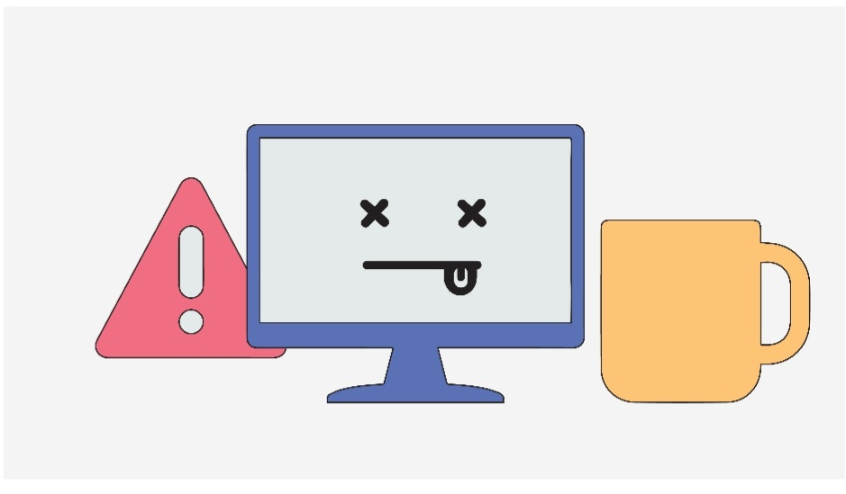
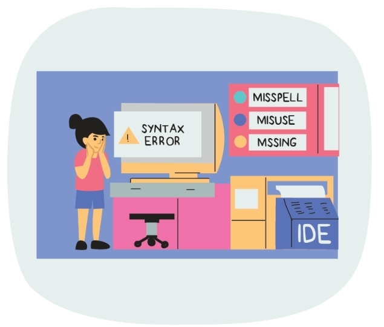
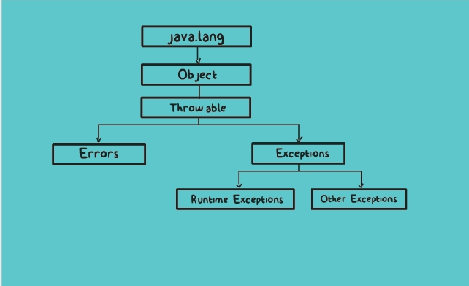

# Handling-Exception-in-Java-journey-3

Let's Bring the try-catch structure into the picture with the help of a simple code.

With the rise of OOP, exception support has become a crucial element of modern programming languages. 
As we know, it plays a vital role when you have some suspicious code that may raise an exception. Handling that exception gracefully is key.
To do that Java provides the following two statements that help us to handle and work with exceiptions,
* Try statement
* Catch statement
->In Java, exceptions can be handled using a try satement. The critical operation which can raise an exception is placed insite the try block repersented using the 'try' keyword.

   As the name suggest, it will try to execute that particular piece of code. If the exception is raised, it creates an exception object. It contains information about the exception such as the name and description of the exception and the state fo the program when the exception occurred.
->This exception object is passed to the catch statement that handles the exception that occurs in the associated try block. The job of this catch block is to handle the exception as elegantly as possible.
Using this catch stmnt. we would declare the thype of exception that we are trying to catch and handle. Therefore, if the type of exception that occurred is listed in a catch block, the exception is passed to the catch as an argument.
If the exceptions are not raised, the statements inside the try block are executed and the control is passed to the next statements.

The Exception class provides some methods to fetch more information about the exception that has occurred if required. These methods can be used by all of the subclasses of the Exception class.
*Following are two important methods that you should know,
1) public String getMessage(): The getMessage() method is used to return a detailed message of the Throwable object which can also be null. One can use this method to get the detailed message of exception as a string value.
2) public void printStackTrack(): The printStackTrace() method in java is a tool used to handle exceptions and errors. It prints the throwable along with other derails like the line number and class name where the exception occurred. Hence, printStackTrace() is very useful in diagnosing exceptions.

 

